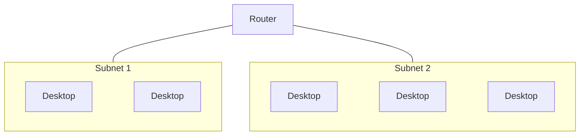

```mermaid
%%{ init: { 'flowchart': { 'curve': 'bump' } } }%%
graph TD
    A[Router]
 
    subgraph F[Subnet 1]
        direction LR
        F1[Desktop]
        F2[Desktop]
        F1 ~~~ F2
    end

    subgraph R[Subnet 2]
        direction LR
        R1[Desktop]
        R2[Desktop]
        R3[Desktop]
        R1 ~~~ R2
        R2 ~~~ R3

    end

    A --- F
    A --- R
```
