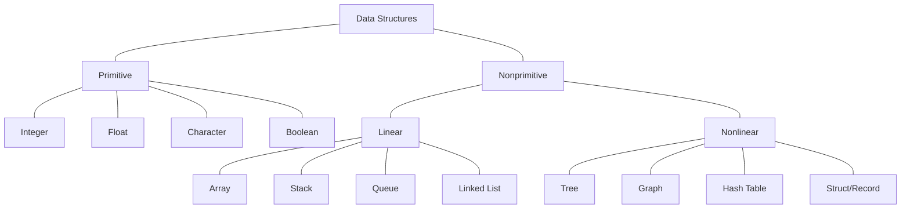

```mermaid
%%{ init: { 'flowchart': { 'curve': 'bump' } } }%%
graph TD
    A[Data Structures] --- B[Primitive]
    A --- C[Nonprimitive]
    B --- F[Integer]
    B --- G[Float]
    B --- H[Character]
    B --- I[Boolean]
    C --- D[Linear]
    C --- E[Nonlinear]
    D --- J[Array]
    D --- K[Stack]
    D --- L[Queue]
    D --- M[Linked List]
    E --- N[Tree]
    E --- O[Graph]
    E --- P[Hash Table]
    E --- Q[Struct/Record]
```
