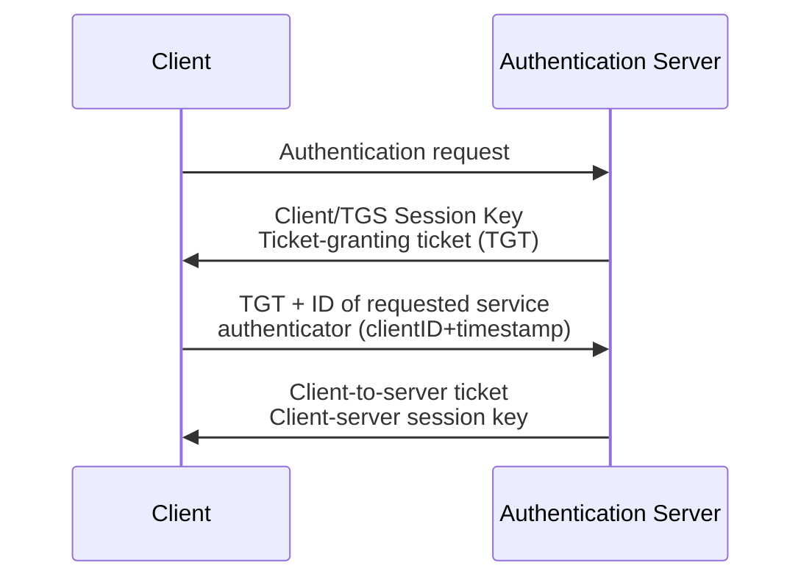
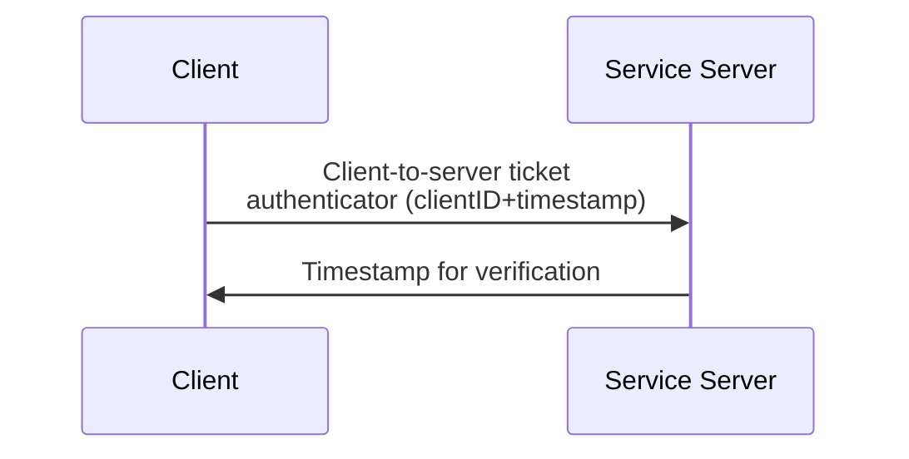

```mermaid
sequenceDiagram
    participant Client 
    participant Authentication Server  

    Client->>Authentication Server: Authentication request
    Authentication Server->>Client: Client/TGS Session Key<br/>Ticket-granting ticket (TGT)
    Client->>Authentication Server: TGT + ID of requested service<br/>authenticator (clientID+timestamp)
    Authentication Server->>Client: Client-to-server ticket<br/>Client-server session key 
```

```mermaid
sequenceDiagram
    participant Client 
    participant Service Server  

    Client->>Service Server: Client-to-server ticket<br/>authenticator (clientID+timestamp)
    Service Server->>Client: Timestamp for verification
```
