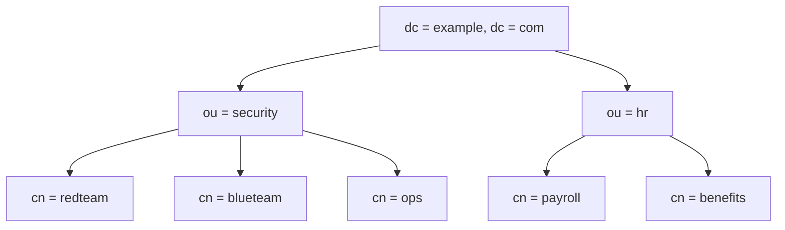

```mermaid
%%{ init: { 'flowchart': { 'curve': 'bump' } } }%%
graph TD
    A[dc = example, dc = com] --> B[ou = security]
    A --> C[ou = hr]
    B --> D[cn = redteam]
    B --> E[cn = blueteam]
    B --> F[cn = ops]
    C --> G[cn = payroll]
    C --> H[cn = benefits]
```

