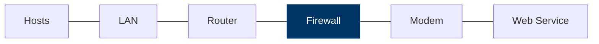

```mermaid
flowchart LR
    Hosts["Hosts"] --- LAN["LAN"]
    LAN --- Router["Router"]
    Router --- Firewall["Firewall"]:::highlight
    Firewall --- Modem["Modem"]
    Modem --- WebService["Web Service"]

    classDef highlight fill:#003366,stroke:#003366,stroke-width:2px,color:#ffffff;
```