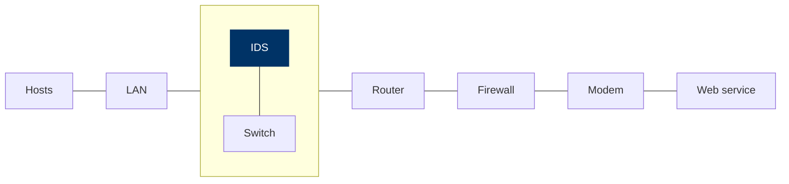

```mermaid
flowchart LR
    H[Hosts] --- G[LAN]
    G --- F

    subgraph F[" "]
        F1[IDS]:::highlight
        F2[Switch]
        F1 --- F2
    end

    F --- D[Router]
    D --- C[Firewall]
    C --- Z[Modem]
    Z --- A[Web service]

    classDef highlight fill:#003366,stroke:#003366,stroke-width:2px,color:#ffffff;
```