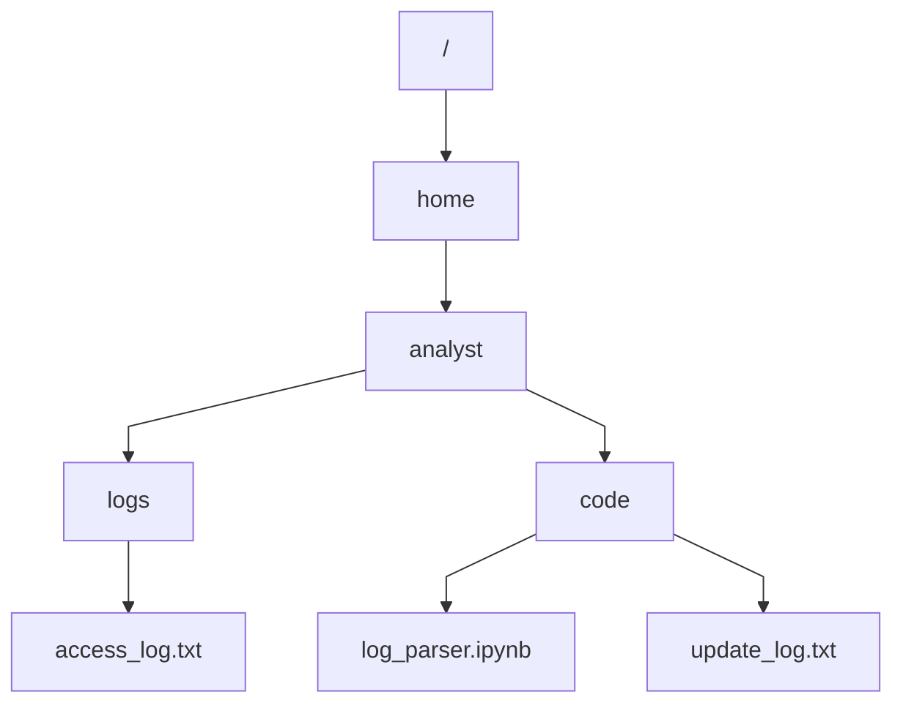

```mermaid
%%{ init: { 'flowchart': { 'curve': 'linear' } } }%%
graph TD
    A["/"] --> B[home]
    B --> C[analyst]
    C --> D[logs]
    C --> E[code]
    D --> F[access_log.txt]
    E --> G[log_parser.ipynb]
    E --> H[update_log.txt]
```